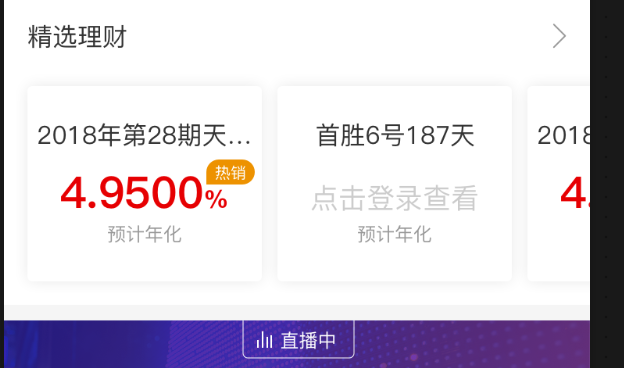
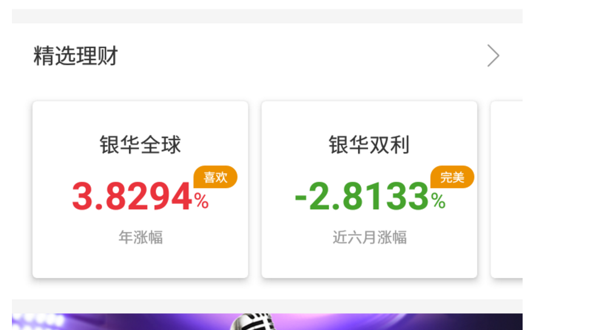
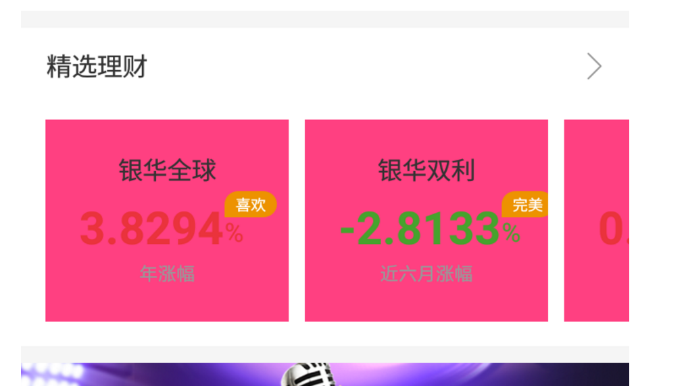

# 一、背景
项目里对ui的要求不是很高，所以大部分时候我们都没有做屏幕适配，基本上设计图上多少px，xml里就写多少dp（当然，这也要基于设计用的ios屏幕是375x667），所以做出来的效果和最初设计图其实是有些细微的差距的，比如某项目首页有如下设计图：

我们按照1：1编写xml，那么显示的结果是这样的：


咋一看貌似没啥问题，但仔细对比就会发现，第三个理财的item露出的宽度太小了，以至于收益数字没有显示出来。然而，客户要求，收益数字必须露出来，以便让用户知道右边还有内容可以查看。
这就是没有对ui做屏幕适配导致的结果。
# 二、头条方案
屏幕适配个人比较认同今日头条的方案（[点击这里查看](https://mp.weixin.qq.com/s/d9QCoBP6kV9VSWvVldVVwA)），低侵入，现有项目可以用，不需要改变原来写界面的习惯，同时也不会产生很多文件夹。但是头条方案有一个致命的缺点，就是修改了系统的density，可能会对现有的布局的解析造成影响。因此有必要基于头条方案做一下封装，使其可以针对具体的页面做适配，其余页面不受影响。
要做到针对具体的页面做适配，就要把握好两个时机。第一个是何时开启适配（即按照头条方案修改系统density），这个比较容易想到只需要让使用者在Activity的setContentView之前调用一下我们提供的方法即可；第二个是何时结束适配（即还原系统的density），这一点不太好把握，如果是在activity的生命周期回调里做，因为activity的生命周期场景比较多，同时还要考虑Dialog和Fragment等，所以难度比较大。
# 三、抛砖引玉
对此，本人倒是有一个不太完美的解决方案，姑且抛砖引玉。
仔细想一下，我们之所以修改系统的density，主要原因就是按系统原来的density解析布局文件，得到的px不是我们想要的。那么，我们能不能在系统开始解析xml时，悄悄修改density，然后在系统解析xml完毕时，又悄悄把density该回原来的值呢？顺着这个思路，本人注意到了LayoutInflater这个类，这是用来做布局解析的，相信大家很熟了。经过研究，我发现针对每一个activity，都有一个LayoutInflater与其对应，所以如果能知道LayoutInflater什么时候开始解析布局文件，又什么时候结束解析，那么就可以完美的根据不同的activity分别做适配了。
然而，很不幸，activity的LayoutInflater不支持自定义，同时LayoutInflater本身也不支持设置相关的监听。
局面似乎就卡在了这里，对于这一点，本人到目前为止没有想到比较靠谱的解决方案，这也就是为什么我说这个方案不太完美的原因。既然不能直线解决，我们就曲线救国，这里给出两个监听LayoutInflater解析的方案：
1、给所有的activity的LayoutInflater添加一个自定义的Factory，这个Factory不会返回实际的View，只是监听LayoutInflater被使用的时机。当外界告知某个activity需要做适配时，则标记与其对应的自定义Factory为需要适配状态，一旦该Factory被使用，如果发现没有开启屏幕适配，则开启之。此时屏幕适配就这样一直开启，直到另一个没有使能屏幕适配的Factory被使用时，关闭适配。
2、对LayoutInflater进行封装，外界使用这个封装的类做解析。框架内部在解析前开启适配，在解析结束则关闭适配。
方案一很明显适配关闭的时机没有掌控很好，此时可能会出现因为修改density而产生不可预估的影响。不过如果再加上每一次页面关闭，就关闭适配，这个影响应该不会很大。
方案二的缺点就是偶合比较大，并且无法兼容现有代码。
本人倾向于方案一，因此后面的封装基于方案一。

# 四、封装
有个方案，接下来就是细节的封装了，直接来看下框架的使用。

首先需要在AndroidManifest.xml中的application节点增加如下代码

```
<meta-data
    android:name="design_width_in_px"
    android:value="375" />
<meta-data
    android:name="design_height_in_px"
    android:value="667" />
```

PS：如果不是设计用的尺寸不是上面的，那么xml里写dp时也要相应的成倍缩放。

然后是框架初始化，必须要调用

```
ScreenAdaptManager.get().init(this);
```
如果想看具体哪个页面使能适配，哪个页面关闭适配，可以打开日志调试

```
ScreenAdaptManager.get().enableDebug();
```
最后只需要在需要适配的页面setContentView之前调用如下方法即可

```
ScreenAdaptManager.get().adapt(this);
```
另外，框架还提供了一个局部适配的方法

```
ScreenAdaptManager.get().adapt(view);
```
这里如果传ViewGroup，则所有嵌套的子View都会做适配。能调用此方法，意味着布局肯定已经解析完毕了。所以这个方法的适配原理跟上面讲的没有关系。这个方法适配的原理是通过反推每个尺寸原来的dp值，然后利用相应的density重新计算px值，最后设置回去完成适配。所以很明显，这种方式只能枚举所有和尺寸有关的属性，然后一一修改。目前暂时支持了宽高、margin、padding和textSize，支持扩展。
为什么要支持这个局部适配呢？
如果还记得上面本人给出的场景就明白了，因为要做适配的ui在app的首页，如果此时针对首页所在的activity做适配，那就相当于给整个app做适配啦，因此为了规避风险，支持了局部适配。
最后看下适配前后的对比
设计图：


适配前：


适配后：


可以看到，适配以后，第三个item的收益数字露出来了，并且露出来的大小与原设计图一毛一样。
PS：请忽略这里item的背景，因为在调试时尺寸有一些微小差异，本人以为是CardView导致的，所以换了FrameLayout暂时看下适配效果。


